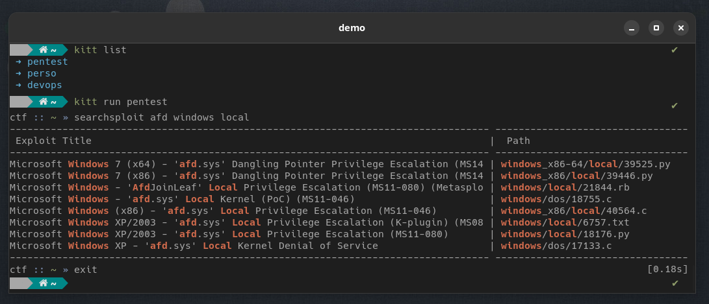

# Kitt

Kitt is a container based portable shell environment manager.

Build, spawn, push and distribute your shell, with your tools, and your config, anywhere.

## Demo



## Installation

First, make sure you have python3 and Docker installed.

To use kitt as a non root user, you should be in docker group : `sudo usermod -aG docker USER`.

```
➜  pip install kitt-shell
```

.. or just run `kitt.py` from sources.

> 

## How to use Kitt

Fill a configuration file (see [examples folder](./examples)) either in `toml` or `json` format. 
Feed it to Kitt and let the magic happend !

```
➜  kitt build examples/devops.conf devops
✓ Build success !

➜  kitt run devops
user@kitt:~# 
```

Not your computer but you need your tools ? No problem.

```
➜  kitt pull senges/kitt devops
✓  Image devops pull done

➜  kitt run devops
user@kitt:~# 
```

Few commands workflow examples are available in [examples folder](./examples/commands.md).

### Kitt CLI reference

```
➜  kitt --help

Usage: kitt [OPTIONS] COMMAND [ARGS]...

  main command group

Options:
  -h, --help   Show this message and exit.
  -d, --debug  Debug mode

Commands:
  build    Build image from source config file
  inspect  Show image metadata
  list     List local images
  patch    Patch image runtime metadata
  prune    Prune local images
  pull     Pull image and exit
  push     Push kitt image to registry
  refresh  Pull latest version of local images
  remove   Remove local image
  run      Run kitt shell
  version  Show version
```

## Configuration
### Basics

```toml
[options]
docker_in_docker = false    # Share docker socket
forward_x11 = false         # Configure x11 forward

[workspace]
image = "ubuntu:22.04"  # OCI System Image
tools = []              # Nix tools
user = "user"           # Username inside container
hostname = "kitt"       # Container hostname
default_shell = "bash"  # One of bash, zsh, sh, dash

# [[workspace.envs]]  # Container exported ENV (multiple)
# name = ""
# value = ""

# [[workspace.volumes]]   # Container bind volumes (multiple)
# host = ""   # Local directory
# bind = ""   # Bin inside container
# mode = ""   # Mode (default is 'rw')

# [secrets]
# [[secrets.files]]   # File entry (multiple)
# src = ""                    # Host path
# dest = ""                   # Container path
# [[secrets.envs]]   # Env variable (multiple)
# name = ""                   # Variable name
# value = ""                  # Secret value
```

For more details about **Nix tools**, see [tools installation](#Tools-installation) section.

### Secrets

Kitt is able to embed password encrypted secrets (files and env vars) inside an image.

A password prompt will be shown at container runtime to decrypt and restore the secrets :
* Env vars are loaded inside the container
* Files are restored insed a tempFS destoyed at container exit

> **Warning**  
> Kitt vault uses SHA256(password) as AES encryption key.
> Use with caution, weak password could lead to sensitive information leak.

### Plugins

Kitt offers multiple _optional_ plugins to improve environment customization.

| Plugin     | Description                           | Requires |
|------------|---------------------------------------|----------|
| _zsh_      | install and setup Zsh (oh-my-zsh)     |          |
| _copy_     | copy local files inside container     |          |
| _download_ | download ressources inside container  | curl     |
| _git_      | clone git repository inside container | git      |
| _pip_      | install pip package                   | pip      |

See [PLUGINS.md](./PLUGINS.md) for configuration details.

**Need another plugin ?**

Add jinja formated plugin inside `kitt/static/plugins` folder and use it in your config file under the same name.

## How does it work ?

Kitt will build an [OCI Container Image](https://github.com/opencontainers/image-spec) (compatible with Docker, Podman, ...), according to the provided configuration file. It will install requested tools inside, setup your desired shell(s), shortcuts, completion, plugins, and add your configuration files.

At runtime, Kitt will create a container from this image, spawn a shell inside and attach it to your current TTY. 

### Tools installation

For the tool installation part, Kitt relies on the huge 80k+ packages [NixOS Store](https://search.nixos.org). 
It does provide an uniform OS agnostic way of installing tools inside containers, and can be extended if necessary.

Thanks to Nix, you can effortlessly change your base image OS, anytime.

### Containerization

> At first, kitt was meant to run with Podman as it is rootless by design (which solves uig/gid mapping problems).  
> However, for multiple reasons, it should now mainly run with Docker.
> Podman support is in progress, see branch `feat/podman`.

**What is UID/GID reflexion ?**

> TL;DR: It's great for shared folders file rigths.

Kitt uses [fixuid](https://github.com/boxboat/fixuid) project to reflect host user UID/GID inside the container. What does that means ?

As Docker containers run as root (except rootless ones, but still), if you have a shared volume
between your host and container, files created inside the container will be owned by root on the host. This mecanism makes working with volumes for user owned files very unconvenient.

With `fixuid`, the user inside the container will have the exact same real `uid` as your current host user. So if you bind a directory (your `home` for example), any file created by the user inside the container will be own by your user on the host side instead of root.